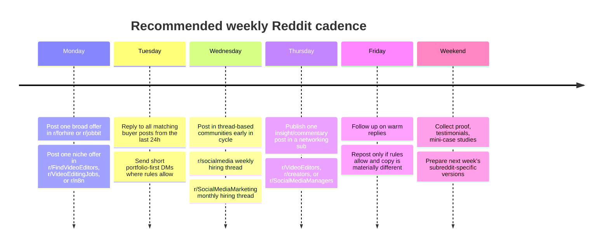

# Reddit Communities for Paid Work and Freelance Gigs

## Executive summary

Reddit can work for freelance lead generation, but the market is highly segmented. The strongest **direct-response** boards for your stated skill clusters are: **r/forhire** for broad paid gigs, **r/FindVideoEditors** and **r/VideoEditingJobs** for editor-specific demand, **r/socialmedia** and **r/SocialMediaMarketing** for social-media hiring threads, and **r/n8n** plus **r/jobbit** for higher-skill automation and technical workflow work. By contrast, communities like **r/slavelabour**, **r/DoneDirtCheap**, **r/freelance_forhire**, **r/Automate**, and **r/PromptEngineering** do surface opportunities, but recent posts skew more toward low-budget requests, vague offers, or discussion rather than consistent buyer-quality hiring. citeturn40view0turn10view0turn34view0turn13view0turn37view0turn41view0turn31view0turn29view0turn30view0turn28view0turn15view0turn42view0

My practical ranking is therefore not based only on audience size; it is based on a combination of visible rules, how often paid requests appear, whether the subreddit centralizes hiring in dedicated threads, and how specific recent buyers look. Communities that force budget disclosure, company details, or structured hiring posts generally produce better signal than “anything goes” boards. citeturn40view2turn35view0turn12view0turn25search0turn24search2turn15view1

### Top subreddits to prioritize

| Priority | Subreddit | Why prioritize it |
|---|---|---|
| Top | **r/forhire** | Large general paid-work board; explicit rules and guidelines; recent paid remote jobs are visible on the main feed. citeturn4view0turn40view0 |
| Top | **r/FindVideoEditors** | Best direct client-to-editor board I found for short-form, YouTube, and creator editing work; rules explicitly say only clients can post. citeturn11view1turn11view2 |
| Top | **r/VideoEditingJobs** | Purpose-built jobs board for editors; only clients can post; recent posts include short-form, long-form, AI-video, and creator roles. citeturn40view2turn34view0 |
| High | **r/videography** | Not a pure job board, but it has a dedicated **Hiring / Job Posting** flair and requires budget, dates, and country. citeturn12view0 |
| High | **r/socialmedia** | Dedicated **weekly hiring thread** with paid-only rules and explicit formatting for both hiring and for-hire comments. citeturn13view0turn25search0turn25search3 |
| High | **r/SocialMediaMarketing** | Professional SMM audience plus a **monthly hiring thread** and a separate self-promotion thread. citeturn37view0turn24search2 |
| High | **r/n8n** | One of the clearest AI/workflow communities for real specialist demand; rules explicitly allow recruiting/hiring if company info is disclosed. citeturn15view1turn41view0 |
| High | **r/jobbit** | Best Reddit-native technical job board for automation-oriented developers/consultants; useful if you package AI workflow implementation as engineering work. citeturn8view0turn31view0 |
| Medium | **r/VideoEditors** | More community/networking than marketplace, but creator-posted hiring is allowed if flaired and budgeted; useful for credibility and referral flow. citeturn35view0turn36view0 |
| Medium | **r/creators** | Small, but directly relevant for editor/social/content offers because creator-side buyers do post here. citeturn20view0turn19search11 |

## How I evaluated communities

I prioritized **primary-source evidence** from individual subreddit pages: About pages, visible rules, pinned hiring threads, and current/recent feed posts. Where Reddit clearly labeled a count as **members**, I used it as the subscriber count. Where Reddit’s 2026 UI showed unlabeled rounded numbers, I marked subscriber count as **unspecified** rather than guessing. Activity level is a practical estimate based on visible recent feed density, and **client quality** is my judgment from the recent mix of budgets, specificity, company transparency, and whether the subreddit’s rules actively screen out low-effort or scammy posts. citeturn11view1turn40view2turn12view0turn25search0turn24search2turn15view1turn41view0

This is a **high-confidence longlist**, not a claim that every relevant subreddit on Reddit is included. I excluded or deprioritized communities that were mainly discussion-only, had little evidence of current hiring, or were clearly unsuitable for direct self-promotion. A few adjacent communities are included because they generate buyer intent even when they are not formal job boards. citeturn13view1turn13view2turn23view0turn15view0turn42view0

## General job and freelance marketplaces

| Subreddit | Description | Subscriber count | Typical activity | Hiring-specific flairs / threads | Job-offer rules that matter | Client quality | Example recent job post |
|---|---|---:|---|---|---|---|---|
| **r/forhire** | Broad paid-work marketplace for freelancers and employers. About page shows rules/guidelines and the live feed shows active paid remote hiring. citeturn4view0turn40view0 | **Unspecified**; About page showed a rounded visible count, but not a clearly labeled member count. citeturn4view0 | **High**; multiple visible hiring posts on the front feed. citeturn40view0 | Visible post states include **Hiring - Open**; pinned rules/guidelines and minimum-karma reminders are highlighted. citeturn40view0 | Read the pinned “Rules & Guidelines”; pay transparency and post quality are clearly enforced via mod announcements. citeturn40view0 | **High** for a general board. Recent feed included a specific remote support role at **$25/hr** with hours/time-zone requirements. citeturn40view0 | “**[HIRING] Part-Time Customer Support Assistant \| $25/hr \| Remote \| 9-11am EDT**” citeturn40view0 |
| **r/freelance_forhire** | General freelance board with visible **Hiring** and **For Hire** flairs. citeturn28view0 | **Unspecified**; About/feed UI showed rounded counts without an explicit member label. citeturn28view0 | **High**, but noisy; several fresh hiring/for-hire posts appear close together. citeturn28view0 | **Hiring** and **For Hire** flairs are active. citeturn28view0 | No clearly surfaced centralized hiring thread in the captured page; quality depends heavily on screening each post yourself. citeturn28view0 | **Low** overall. Recent visible posts included sign-up tasks, Reddit-posting gigs, and generic chat-sales roles mixed with legitimate offers. citeturn28view0 | “**[Hiring] - Social Media Posting, $20-30 an hour (USD)**” citeturn28view0 |
| **r/slavelabour** | Ultra-budget task marketplace built around **Task** and **Offer** posts. Good for fast lead volume, weak for premium positioning. citeturn29view0 | **Unspecified**; UI count was not explicitly labeled as members. citeturn29view0 | **High**; many visible tasks/offers. citeturn29view0 | **Task**, **Offer**, and status markers like **Closed** are visible. citeturn29view0 | Expect aggressive price competition; many posts are very low-ticket or transactional. citeturn29view0 | **Low**. Recent tasks included low-cost data entry and one-off quick-turn edits. citeturn29view0 | “**[Task] Video Editor Needed ASAP - $40 for 1 Minute Clip**” citeturn29view0 |
| **r/DoneDirtCheap** | Another bargain-oriented task board, but with some occasional legitimate professional roles mixed in. citeturn30view0 | **Unspecified**; subscriber count not explicitly labeled in the captured UI. | **Medium**; feed showed active posts but less dense than the biggest general boards. citeturn30view0 | Uses **[HIRING]**, **[Offer]**, and similar title conventions; highlighted announcement says **Reddit tasks are banned**. citeturn30view0 | Read the highlighted scam/task announcement carefully; low-budget work is common. citeturn30view0 | **Low** overall, despite occasional real roles. The feed mixed $20 application-submission help, cheap social-media offers, and one real AWS/cloud/AI consulting role. citeturn30view0 | “**[HIRING] Client Delivery Lead – AWS Cloud & AI Projects**” citeturn30view0 |
| **r/jobbit** | Reddit’s most useful technical job board for developers, technical operators, and workflow builders; especially relevant if you package AI automation as implementation work. citeturn8view0turn31view0 | **Unspecified**; direct page showed rounded counts, not an explicit member label. citeturn31view0 | **Medium**; active feed plus a megathread for for-hire posts. citeturn31view0 | **Hiring**, **Hiring - Open**, and a **For Hire only here** megathread. citeturn31view0 | If you are selling services, use the dedicated for-hire megathread rather than standalone posts. citeturn31view0 | **High** for technical freelancers. Recent posts included workflow-analysis, AI-builder challenge, GTM engineering, and senior engineering roles. citeturn31view0 | “**[HIRING] Data Review & Workflow Analysis Specialists**” citeturn31view0 |
| **r/B2BForHire** | B2B services and wanted ads. Potentially relevant for agencies or consulting-style offers, but the signal quality is uneven. citeturn27view0turn32view0 | **Unspecified**; the captured UI did not clearly label the visible count as members. citeturn27view0 | **High**, but mixed-quality. citeturn32view0 | Uses visible **[Hiring]** and **[For Hire]** title conventions; no dedicated hiring megathread surfaced. citeturn32view0 | Rules ban unethical posts, spam, vague posts, and explicit lead-generation/appointment-setter posts; account age under 2 months is not allowed. citeturn27view0 | **Low** overall. Recent posts include many vague AI-training/data-entry jobs, sign-up offers, and broad “freelance opportunities” posts. citeturn32view0 | “**[Hiring] Remote AI Trainers – $20/hr (Flexible Projects)**” citeturn32view0 |

## Video editing and post-production

| Subreddit | Description | Subscriber count | Typical activity | Hiring-specific flairs / threads | Job-offer rules that matter | Client quality | Example recent job post |
|---|---|---:|---|---|---|---|---|
| **r/FindVideoEditors** | Best pure matchmaking board for clients seeking editors. The rules explicitly say **only clients can post** and ban editors from posting offers. citeturn11view1 | **15,684 members** on a related-community listing captured from the sister network. citeturn40view2 | **High**; feed shows many open paid requests. citeturn10view0turn11view2 | Visible **[Hiring]** and **[Paid]** tags. citeturn11view2 | No service offers, no advertising, no scams, no poor-effort requests; **only clients can post**. citeturn11view1 | **Medium**. Very active, but many posts are short-form creator work with modest budgets; still excellent for lead volume. citeturn11view2turn10view0 | “**[Paid] Role: Video Editor (Social Media: Reels/Shorts), part-time/freelance**” citeturn10view0 |
| **r/VideoEditingJobs** | Sister jobs board focused on video-editing requests only. citeturn40view2turn34view0 | **11,524 members** on an explicit related-community listing. citeturn11view0 | **Medium to high**; several current job posts were visible on the front page. citeturn34view0 | No offer-of-services posts; visible paid/unpaid requests, including **[HIRING]** and **[Volunteer/Unpaid]** posts. citeturn34view0turn40view2 | No offering services, no scamming, no advertising, no poor-effort requests, and **only clients can post**. citeturn40view2 | **Medium**. Good relevance, but the feed includes a mix of quality paid work, lower-budget creator work, and some unpaid documentary asks. citeturn34view0 | “**[HIRING] Video editor - AI filmmaker (US company, top pay in the space, remote)**” citeturn34view0 |
| **r/VideoEditors** | Community + portfolio/networking hub for editors. Valuable for credibility, engagement, and occasional creator hiring, but not a pure jobs board. citeturn35view0turn36view0 | **68,257 members** on a sister-community listing. citeturn40view2 | **Medium**; mostly discussion/feedback, with some hiring posts. citeturn36view0 | Hiring is allowed only in limited circumstances; creator posts can use **Hiring**. citeturn35view0turn36view0 | No advertising; paid/unpaid requests are normally redirected to r/FindVideoEditors; **no agency hiring** and **no hiring posts without rates**. citeturn35view0 | **Medium**. Lower volume than the dedicated jobs boards, but rules improve quality when hiring appears. citeturn35view0turn36view0 | “**Hiring: Video Editor for a Women's Health Content Page**” citeturn36view0 |
| **r/videography** | Broad production community that still matters for higher-value post-production and creator/business shoots because it has a dedicated hiring policy. citeturn12view0 | **Unspecified**; About UI showed a rounded visible count, but not an explicit “members” label. citeturn12view0 | **Medium to high**; active overall, with a dedicated **Hiring / Job Posting** flair. citeturn12view0 | **Hiring / Job Posting** flair. citeturn12view0 | Every hiring post must state **budget**, **relevant dates**, and **country**; unpaid or exposure-only work is not allowed. citeturn12view0 | **High** relative to most Reddit boards because the rules force real project details. citeturn12view0 | “**[HIRING] Video Editor (Ad Creative + Long-Form) — Remote/Worldwide — $30/hr+**” citeturn9search10 |

## Social media management and content strategy

| Subreddit | Description | Subscriber count | Typical activity | Hiring-specific flairs / threads | Job-offer rules that matter | Client quality | Example recent job post |
|---|---|---:|---|---|---|---|---|
| **r/socialmedia** | Large professional discussion community that runs a structured **weekly hiring thread** for both hiring and for-hire comments. citeturn13view0turn25search0 | **2,106,067 members** on an explicit related-community listing. citeturn23view0 | **High** overall; the hiring venue refreshes weekly. citeturn25search0turn25search3 | **Weekly Hiring Thread: Social Media Professionals**; comments should start with **[HIRING]** or **[FOR HIRE]**. citeturn25search0turn25search3 | Standalone job posts are removed; opportunities must be paid; salary/rate is requested; equity-only and commission-only roles are rejected. citeturn25search0turn25search3 | **High** for Reddit, because the thread enforces a standardized hiring format. citeturn25search0turn25search3 | “**Weekly Hiring Thread: Social Media Professionals**” citeturn25search0 |
| **r/SocialMediaMarketing** | Professional SMM community with a **monthly hiring thread** and a separate promo thread. Strong fit for social strategy, brand growth, and content-ops work. citeturn37view0turn24search2 | **291,737 members** on an explicit related-community listing. citeturn23view0 | **Medium to high**; active discussion plus monthly hiring. citeturn37view0turn24search2 | **Monthly Hiring Thread for Social Media Marketers** and **Monthly Self Promotion/Advertisement Thread**. citeturn37view0turn24search2 | Hiring is centralized in the monthly thread; the thread asks for skills, goals, timelines, and whether the opportunity is paid. citeturn24search2turn24search9 | **Medium to high**. The audience is professional, though you will still need to screen for fit and seriousness. citeturn37view0turn24search2 | “**Monthly Hiring Thread for Social Media Marketers**” citeturn24search2 |
| **r/SocialMediaManagers** | Best used as a **networking/intelligence** community, not a direct pitch destination. Buyers still leak in, but the rules explicitly ban job posts and job-related comments. citeturn23view0 | **16K** visible count on About page; formal subscriber count not explicitly labeled, so treat as **unspecified**. citeturn23view0 | **Medium** for discussion; direct-job activity is inconsistent and often against the rules. citeturn22view0turn23view0 | Topic flairs include **Strategy**, **Trends**, **Tools**, **Help/Advice**, but no sanctioned hiring thread was surfaced. citeturn23view0 | **No job related posts or comments**; no self-promotion; no service promotion. citeturn23view0 | **Low** for direct acquisition, because even legitimate buyer-interest posts can conflict with the rules. Use it for intelligence, not prospecting. citeturn23view0turn22view0 | “**1.1M on Instagram, looking for a social media manager**” citeturn22view0 |

## AI workflow, automation, and prompt engineering

| Subreddit | Description | Subscriber count | Typical activity | Hiring-specific flairs / threads | Job-offer rules that matter | Client quality | Example recent job post |
|---|---|---:|---|---|---|---|---|
| **r/n8n** | Best Reddit-native niche for **AI workflow implementers**, especially if you sell automation builds, integrations, internal tools, and workflow maintenance. citeturn15view1turn41view0 | **Unspecified**; About page showed rounded counts, but not an explicit member label. citeturn15view1 | **High** overall, with occasional but meaningful hiring posts. citeturn41view0 | Explicit flair: **Now Hiring or Looking for Cofounder**. citeturn18search6turn41view0 | Recruiting/hiring is allowed, but posters must share **company name + website**, or LinkedIn if no company website exists; project description is required. Client-seeking “how do I sell automation” posts are off-topic. citeturn15view1 | **High**. Recent buyers asked for real n8n/AI automation experience, prompt engineering skill, and workflow maintenance. citeturn41view0turn18search14turn18search17 | “**N8N AI Automation Developer (Remote)**” citeturn41view0 |
| **r/PromptEngineering** | Huge audience and useful for positioning, but weak as a direct jobs board. Most visible activity is discussion; direct hiring appears sporadically. citeturn42view0turn17search0 | **Unspecified**; About page showed **242K** but did not explicitly label that number as members. citeturn42view0 | **High discussion activity**, **low direct-job density**. citeturn17search0turn17search2turn17search6 | No dedicated hiring thread or hiring-specific rule was surfaced in the captured About page. Recent hiring posts used general flairs like **Requesting Assistance**. citeturn42view0turn17search6 | Because job structure is weak, treat it primarily as a brand/insight venue unless a buyer post clearly matches your specialization. citeturn17search0turn17search2 | **Low** for direct gigs. There is clear demand-adjacent discussion, but direct opportunities appear rare. citeturn17search0turn17search2turn17search5 | “**[Hiring] AI Video Creators for Short Form Content, $300–$700 USD Per Week**” citeturn17search6 |
| **r/Automate** | Broad automation discussion board. It can surface buyer pain points, but it is a weak place for direct self-promotion. citeturn15view0 | **Unspecified**; About page showed a rounded visible count without an explicit member label. citeturn15view0 | **Low to medium** for direct gigs; stronger for problem discovery than for buyer conversion. citeturn15view0turn38search7 | No dedicated hiring thread or hiring flair was surfaced. citeturn15view0 | No spam or self-promotion; no SEO marketing campaigns. That makes direct pitching risky. citeturn15view0 | **Low** as a marketplace. Useful mainly for diagnosing repeated manual-work pain points that you can address elsewhere. citeturn38search7turn38search3 | “**Will pay: Looking for a safe way to extract C-suite LinkedIn...**” citeturn38search7 |

## Adjacent communities that fit your skill mix

These are not always the first subs people think of for freelancing, but they are valuable because the buyers already live there. If you sell editing, clipping, publishing support, content ops, show-note workflows, or packaging strategy, these communities can outperform generic freelance boards because the context is already built in. citeturn20view0turn20view1turn33view0

| Subreddit | Description | Subscriber count | Typical activity | Hiring-specific flairs / threads | Job-offer rules that matter | Client quality | Example recent job post |
|---|---|---:|---|---|---|---|---|
| **r/creators** | Small but directly useful for creator-side buyers who need editors, content support, or growth help. citeturn20view0 | **Unspecified**; About page showed **3.5K** but did not explicitly label the number as members. citeturn20view0 | **Medium**. Small community, but active enough that targeted posts can stand out. citeturn20view0turn19search15 | No dedicated hiring flair surfaced; relevant posts often appear under **Discussion** or **Resource**. citeturn20view0turn19search3 | Self-promo must be “earned”: if you link your work, add real value, lessons, or data rather than a naked sales pitch. citeturn20view0 | **Medium to high** because buyers are often content creators with clear use cases. citeturn19search3turn19search11 | “**[Hiring] Freelancer Video Editor for Per Reel/Long Video— Paid, Remote, Ongoing**” citeturn19search11 |
| **r/podcasting** | Strong adjacent market for podcast editors, clip repurposers, show-note writers, and social content managers. citeturn20view1 | **Unspecified**; About page showed **70K** but did not explicitly label it as members. citeturn20view1 | **High** discussion volume, but direct promotion is constrained. citeturn20view1turn21search16 | No verified hiring flair surfaced; product/service promotion is confined to a **weekly Product or Service promotional thread**. citeturn20view1 | Podcast self-promo is banned outside dedicated threads; products/services are also limited to weekly threads; low-karma and low-account-age automod filters apply. citeturn20view1 | **Medium**. Real buyers are present, but you need to comply carefully with thread-based promo rules. citeturn20view1turn21search16 | “**Hiring A Podcast Editor for Solo Self-Development Podcast!**” citeturn21search16 |
| **r/HireaWriter** | Worth using if you sell **YouTube scripts, newsletters, LinkedIn ghostwriting, captions, or SEO-backed content strategy** alongside editing/SMM. citeturn33view0 | **Unspecified**; feed page did not provide a clearly labeled subscriber count in the captured lines. citeturn33view0 | **High**; hiring and for-hire writing posts are frequent. citeturn33view0 | Visible flairs include **Hiring (General)**, **Hiring (Entry Level)**, and **Hire Me**. citeturn33view0 | Strong fit if your offer includes scripting or copy; weaker if you are purely execution-only in post-production. citeturn33view0 | **High** for writing-adjacent services. Recent posts included agency SEO content hiring and tech/AI blog assignments. citeturn33view0 | “**[HIRING] Looking for content writers with SEO copywriting skills to join our digital marketing team**” citeturn33view0 |

## Posting playbook, templates, and compliance

The best Reddit strategy is **not** to drop the same pitch everywhere. Use a layered sequence instead: start with one broad board and one niche board on the same day, then reply aggressively to relevant buyer posts for 48 hours, then adapt the angle for one adjacent community rather than cross-posting the identical body text everywhere. For example: a video editor might post first in **r/forhire** and **r/FindVideoEditors**, then comment in **r/VideoEditors**, then post a creator-facing version in **r/creators** or **r/podcasting**. A social-media operator should prioritize **r/socialmedia**’s weekly thread and **r/SocialMediaMarketing**’s monthly thread before trying adjacent creator communities. An automation consultant should lead with **r/n8n** and **r/jobbit**, then use **r/Automate** mostly for pain-point research rather than direct promotion. citeturn40view0turn11view1turn35view0turn20view0turn20view1turn25search0turn24search2turn15view1turn31view0turn15view0

Timing should follow the subreddit’s structure, not a generic “best time to post” myth. Weekly or monthly thread communities reward being early in the thread cycle; open-feed marketplaces reward quick response time more than perfect posting time. On high-volume boards, your **response speed in the first hour** is often more important than the clock you post at. On niche boards like **r/n8n** or editor-specific communities, your success depends more on fit, specificity, portfolio relevance, and whether you clearly match the posted workflow or style. citeturn25search0turn24search2turn41view0turn10view0turn34view0



The most important compliance rules are simple but non-negotiable. On **r/FindVideoEditors** and **r/VideoEditingJobs**, editors should **not** post service offers because only clients are allowed to create posts. On **r/VideoEditors**, a hiring post needs a rate and agencies are blocked. On **r/videography**, hiring posts must include budget, timing, and country. On **r/socialmedia**, hiring belongs in the weekly thread. On **r/SocialMediaMarketing**, use the monthly hiring thread. On **r/SocialMediaManagers**, job posts are banned. On **r/n8n**, recruiting posts need company identification and project detail; business-side “how do I sell automation” posts are off-topic. On **r/podcasting**, product/service promotion is confined to the weekly promo thread. citeturn11view1turn40view2turn35view0turn12view0turn25search0turn24search2turn23view0turn15view1turn20view1

### Outreach template for video editors

```text
[FOR HIRE] Video editor for shorts + long-form

I help creators and small brands turn raw footage into clean, retention-focused edits.

Best fit:
• YouTube videos, Reels, Shorts, TikToks
• Talking-head, commentary, educational, podcast clips, creator brands
• Captioning, hook text, cutdowns, pacing, light motion graphics, sound cleanup

What I can take off your plate:
• Raw footage -> finished edit
• 1 long-form video -> multiple short clips
• Thumbnail / metadata suggestions if useful
• Fast turnaround and revision tracking

If you reply, I’ll send:
• 3 relevant samples in your niche
• My turnaround times
• Pricing options: per video, monthly package, or trial edit

Timezone:
Availability:
Preferred communication:
```

### Outreach template for social media managers and content strategists

```text
[FOR HIRE] Social media manager / content strategist

I help brands and creators turn scattered posting into a repeatable content system.

What I do:
• Content planning and calendar creation
• Reels / Shorts / carousel strategy
• Caption writing and repurposing
• Community management / publishing workflows
• Weekly reporting with clear next actions

Best fit:
• Founder-led brands
• Personal brands
• Coaches / educators
• Small teams that have content but no system

My approach:
• Start with one platform + one content pillar
• Build a 2-4 week content engine
• Repurpose winners instead of reinventing everything
• Track what drives saves, shares, replies, and qualified leads

Happy to share:
• A mini audit
• A sample weekly plan
• Portfolio / past results
• Package pricing
```

### Outreach template for AI workflow consultants

```text
[FOR HIRE] AI workflow / automation consultant

I build practical automations for teams that are stuck doing repetitive manual work.

Typical projects:
• Lead intake and routing
• CRM / sheet / email / WhatsApp workflows
• Research and summarization pipelines
• Content repurposing workflows
• Internal AI copilots with guardrails
• n8n / API / prompt / ops automation

What I focus on:
• Clear business outcome
• Reliable workflows, not demo-only agents
• Documentation and handoff
• Fast iteration on one high-ROI process first

If helpful, I can start with:
• A short workflow audit
• A scoped pilot
• A fixed-price MVP
• Ongoing maintenance after launch

Reply with the process you want to automate and the tools you already use.
```

### Cross-posting recommendations

Use **one offer, three versions**:

- **Marketplace version** for r/forhire or r/jobbit: headline, rate model, hard deliverables, availability, portfolio.
- **Niche-buyer version** for r/FindVideoEditors, r/VideoEditingJobs, r/socialmedia weekly thread, or r/n8n: speak in the buyer’s language and mention exact use cases.
- **Insight version** for r/VideoEditors, r/creators, or r/SocialMediaManagers: share a lesson, workflow, or observation first, then invite replies softly. citeturn40view0turn31view0turn11view1turn40view2turn25search0turn15view1turn35view0turn20view0turn23view0

A good operating rhythm is to keep **two public posts live per week** and then spend more time on **replying to buyer posts** than on creating new top-level posts. Reddit rewards relevance and trust much more than brute posting frequency. If you only do one thing consistently, make it this: **respond fast, with niche-matched samples, and with a short message that proves you actually read the request**. That pattern aligns with the complaints visible in editor/job communities, where many posters explicitly say they ignore vague DMs and poor responses. citeturn10view0turn11view2turn34view0

A final caution: if your goal is premium freelance work, do not let the low-rate boards set your positioning. Use them tactically for volume or experiments if you want, but build your main Reddit presence around the higher-signal communities with stronger moderation or more explicit hiring structure: **r/forhire**, **r/FindVideoEditors**, **r/VideoEditingJobs**, **r/videography**, **r/socialmedia**, **r/SocialMediaMarketing**, **r/n8n**, and **r/jobbit**. citeturn40view0turn11view1turn40view2turn12view0turn25search0turn24search2turn15view1turn31view0